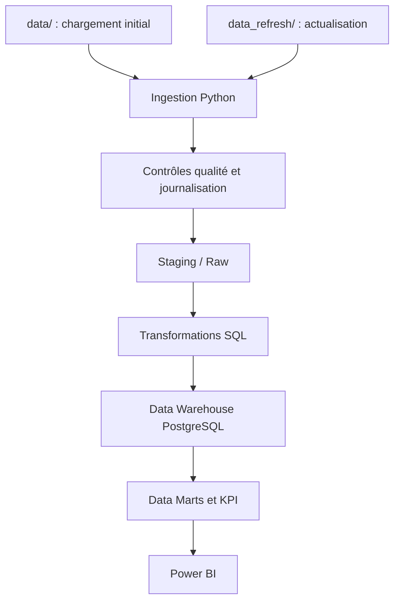

# UC-02 — Schéma d'architecture

```mermaid
flowchart TD
    A["data/ : chargement initial"]
    B["data_refresh/ : actualisation"]

    A --> C["Ingestion Python"]
    B --> C

    C --> D["Contrôles qualité et journalisation"]
    D --> E["Staging / Raw"]
    E --> F["Transformations SQL"]
    F --> G["Data Warehouse PostgreSQL"]
    G --> H["Data Marts et KPI"]
    H --> I["Power BI"]
```