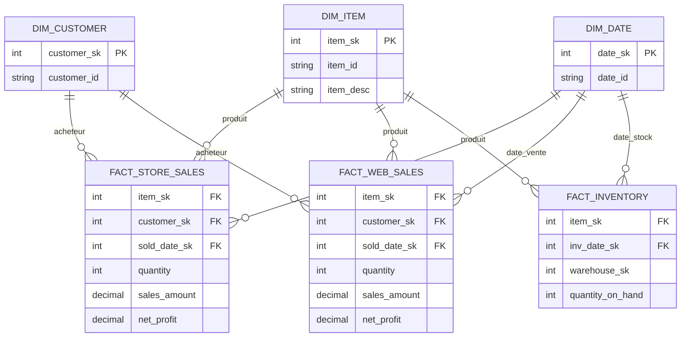

# UC-02 — Modèle dimensionnel conceptuel

```mermaid
erDiagram
    DIM_ITEM ||--o{ FACT_STORE_SALES : produit
    DIM_ITEM ||--o{ FACT_WEB_SALES : produit
    DIM_ITEM ||--o{ FACT_INVENTORY : produit

    DIM_CUSTOMER ||--o{ FACT_STORE_SALES : acheteur
    DIM_CUSTOMER ||--o{ FACT_WEB_SALES : acheteur

    DIM_DATE ||--o{ FACT_STORE_SALES : date_vente
    DIM_DATE ||--o{ FACT_WEB_SALES : date_vente
    DIM_DATE ||--o{ FACT_INVENTORY : date_stock

    DIM_ITEM {
        int item_sk PK
        string item_id
        string item_desc
    }

    DIM_CUSTOMER {
        int customer_sk PK
        string customer_id
    }

    DIM_DATE {
        int date_sk PK
        string date_id
    }

    FACT_STORE_SALES {
        int item_sk FK
        int customer_sk FK
        int sold_date_sk FK
        int quantity
        decimal sales_amount
        decimal net_profit
    }

    FACT_WEB_SALES {
        int item_sk FK
        int customer_sk FK
        int sold_date_sk FK
        int quantity
        decimal sales_amount
        decimal net_profit
    }

    FACT_INVENTORY {
        int item_sk FK
        int inv_date_sk FK
        int warehouse_sk
        int quantity_on_hand
    }
```